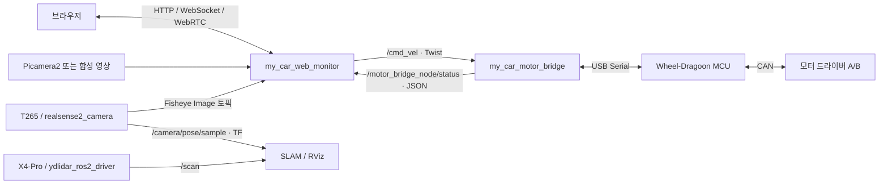

# 차량 ROS 2 워크스페이스

차량 모델 시각화, MCU 모터 제어 연동, 브라우저 영상·상태 모니터링 및 원격 조종을 위한 ROS 2 워크스페이스다. rosbag 재생과 SLAM 실험용 launch 파일도 포함한다.

모터 제어는 외부 **Wheel-Dragoon MCU 펌웨어**와 시리얼로 통신한다. ROS 노드는 속도 명령을 전달하고 상태를 수신하며, 바퀴별 구동 분배와 모터 드라이버 제어는 MCU가 담당한다. MCU 펌웨어와 센서 드라이버는 이 저장소에 포함되어 있지 않다.

## 구성

| 패키지 | 역할 | 빌드 방식 |
| --- | --- | --- |
| [`my_car_package`](src/my_car_package) | 차체 URDF/Xacro·메시, TF, RViz, bag/SLAM 실험 launch | `ament_cmake` |
| [`my_car_motor_bridge`](src/my_car_motor_bridge/README.md) | `/cmd_vel` → MCU 시리얼 명령, 모터 상태 수신, CAN 진단 모드 | `ament_python` |
| [`my_car_web_monitor`](src/my_car_web_monitor/README.md) | FastAPI 웹 UI, WebRTC 영상, ROS 원격 조종, 모터 상태 대시보드 | `ament_python` |

```text
ros2_ws/
├── src/
│   ├── my_car_package/
│   ├── my_car_motor_bridge/
│   └── my_car_web_monitor/
├── agent/                  # 개발 계획 및 작업 보고서
├── build/                  # colcon 빌드 산출물
├── install/                # 설치된 패키지와 환경 설정
└── log/                    # colcon 로그
```

`build/`, `install/`, `log/`의 내용은 Git 추적에서 제외된다. 다른 장비에서는 소스로부터 다시 빌드한다.

## 외부 센서 패키지

T265와 YDLidar X4-Pro 드라이버는 별도 센서 워크스페이스의 `../../robot_ws/ros2_ws/src/`에서 관리한다. 이 저장소로 소스를 복사하지 않고, 빌드된 센서 환경을 먼저 불러와 함께 사용한다.

| 센서 / 패키지 | 역할 | 현재 구성 |
| --- | --- | --- |
| Intel RealSense T265 / `realsense2_camera` | 추정 위치·자세를 `/camera/pose/sample`로 발행하고 관련 TF 제공 | `realsense-ros` 4.0.4 기반, 로컬 소스 수정 포함. 해당 README의 librealsense 지원 버전은 `2.50.0` |
| YDLidar X4-Pro / `ydlidar_ros2_driver` | 2D 거리 스캔을 `/scan`으로 발행 | 외부 `ydlidar_sdk` 필요. launch와 기본 YAML에 로컬 수정 포함 |

RealSense 저장소에는 메시지 패키지 `realsense2_camera_msgs`와 모델 패키지 `realsense2_description`도 포함된다. X4-Pro 설정은 드라이버의 `params/X4-Pro.yaml`에 있으며, 현재 `params/ydlidar.yaml`에도 같은 장비 설정이 적용되어 있다. 주요 값은 포트 `/dev/ttyUSB0`, baudrate `128000`, 프레임 `laser_frame`이다.

센서 드라이버는 기존 워크스페이스에서 유지하고 차량별 센서 설정·TF·통합 launch는 이 워크스페이스에서 관리하는 방향이다. 현재 통합 launch는 아직 없으며, 다른 장비에 환경을 재현할 때는 드라이버 버전뿐 아니라 로컬 수정과 SDK 버전도 함께 보존해야 한다.

기존 센서 워크스페이스의 `my_car_bringup`은 `my_car_description` 모델을 함께 실행하고, `bringup.launch.py`는 SLAM도 실행한다. 현재 `my_car_package` 모델 launch와 함께 실행하면 차체 TF를 중복 발행할 수 있으므로, 아래 예제에서는 센서 드라이버만 각각 실행한다.

## 데이터 흐름



기본 `control` 모드에서 모터 브리지는 50 Hz로 속도 명령을 전송한다. 상태는 System Status v2를 우선 사용하며, 설정에 따라 legacy 상태를 수신할 수 있다. 웹 대시보드는 MCU 상태, 드라이버 전압, 네 바퀴의 RPM·전류·제어 출력·오류를 표시한다. `valid` 플래그와 마지막 수신 경과 시간을 함께 확인하며, 오래된 값은 현재 측정값으로 표시하지 않는다.

## 환경 준비 및 빌드

ROS 2, ROS 환경과 호환되는 시스템 Python, `colcon`, `rosdep`, `uv`가 필요하다. 저장소에서 특정 ROS 2 배포판을 고정하지 않으므로 설치된 ROS 환경을 먼저 불러온다.

**명령은 별도 안내가 없으면 이 README가 있는 워크스페이스 루트에서 실행한다.** 상대 경로는 다음 개발 환경 배치를 기준으로 한다. 다른 배치에서는 외부 워크스페이스를 가리키는 경로를 조정한다.

```text
공통 상위 디렉터리/
├── ros2_ws/                # ROS 2 기본 환경: ../../ros2_ws
├── robot_ws/ros2_ws/       # 센서 환경: ../../robot_ws/ros2_ws
└── car_ws/ros2_ws/         # 현재 워크스페이스: .
```

```bash
source ../../ros2_ws/install/setup.bash
# 일반적인 바이너리 설치 환경에서는 위 명령 대신 사용:
# source /opt/ros/<배포판>/setup.bash

# 센서를 함께 사용할 때 추가 (센서 워크스페이스가 빌드되어 있어야 함)
source ../../robot_ws/ros2_ws/install/local_setup.bash

rosdep install --from-paths src --ignore-src -r -y
```

외부 환경은 ROS 기본 환경 → 센서 환경 → 현재 워크스페이스 순서로 불러온다. `local_setup.bash`는 해당 워크스페이스 환경만 추가하므로, 앞 단계 환경을 명시적으로 불러온 후 사용한다. 기존 `install/setup.bash`에는 과거 빌드의 외부 경로가 저장될 수 있어 아래 실행 예제도 이 순서를 사용한다.

`rosdep`은 초기화 및 인덱스 갱신이 되어 있어야 한다. 웹/영상 Python 의존성은 별도로 가상환경에 설치한다. `rclpy`의 바이너리 호환성을 위해 ROS가 사용하는 시스템 Python과 시스템 패키지 접근을 유지한다.

```bash
cd src/my_car_web_monitor
uv venv --python /usr/bin/python3 --system-site-packages
source .venv/bin/activate
uv sync --active --extra test

cd ../..
python -m colcon build --symlink-install
source install/local_setup.bash
```

가상환경의 Python으로 `python -m colcon`을 실행해야 웹 실행 스크립트가 같은 Python을 사용한다. `colcon` Python 모듈도 이 환경에서 접근 가능해야 한다. 웹 실행 시 `uvicorn` 등을 찾지 못하면 다음 명령으로 실행 스크립트의 Python 경로를 확인하고, 가상환경을 활성화한 상태에서 다시 빌드한다.

```bash
head -1 install/my_car_web_monitor/lib/my_car_web_monitor/web_monitor_node
```

웹 기능이 필요 없다면 가상환경 설정 없이 ROS 환경에서 필요한 패키지만 빌드할 수 있다.

```bash
colcon build --symlink-install --packages-select my_car_package my_car_motor_bridge
source install/local_setup.bash
```

## 실행

새 터미널마다 ROS 환경과 이 워크스페이스를 불러온다. 웹 실행과 아래 테스트에는 가상환경도 활성화한다.

```bash
source ../../ros2_ws/install/setup.bash
# 센서 사용 시 추가
source ../../robot_ws/ros2_ws/install/local_setup.bash
source src/my_car_web_monitor/.venv/bin/activate
source install/local_setup.bash
```

### 카메라·MCU 없이 웹 화면 확인

```bash
CAMERA_SOURCE=synthetic ros2 run my_car_web_monitor web_monitor_node
```

브라우저에서 `http://localhost:8443` 또는 `http://<실행 장비 IP>:8443`에 접속한다. 기본 포트는 8443이지만 현재 서버는 **HTTP**로 실행된다. 합성 영상은 카메라만 대체하며 ROS 환경은 필요하다. 모터 브리지를 실행하지 않아도 웹 화면과 영상을 확인할 수 있고, 모터 상태는 수신 대기 상태로 남는다.

### 모터 브리지 연동

```bash
ros2 launch my_car_motor_bridge motor_bridge.launch.py
```

기본 시리얼 장치는 `/dev/ttyACM0`, 통신 속도는 `115200`이다. 설정은 [`motor_bridge.yaml`](src/my_car_motor_bridge/config/motor_bridge.yaml)에 있으며, 변경 후 노드를 재시작해야 한다. 다른 포트를 일회성으로 지정하려면 launch 대신 노드를 직접 실행한다.

```bash
ros2 run my_car_motor_bridge motor_bridge_node --ros-args -p port:=/dev/ttyACM1
```

별도 터미널에서 웹 노드를 실행하고 상태를 확인한다.

```bash
ros2 topic echo /motor_bridge_node/status
```

실제 차량에 ROS 속도 명령을 적용하려면 MCU가 CONTROL 상태이고 RC 선택이 AUTO여야 한다. 시리얼 포트는 한 프로세스만 사용한다. 웹 입력 중단·연결 종료 시에는 0 속도를 발행하고, 모터 브리지는 기본 0.3초 명령 타임아웃 이후 zero/disable을 전송한다. 웹의 정지 명령은 `/cmd_vel`의 0 속도이며 MCU의 ESTOP 플래그 설정과는 별개다.

CAN 진단용 `serial_mode:=bridge`에서는 `/cmd_vel` 제어와 모터 상태 발행이 비활성화된다. 첫 유효 CAN 요청이 MCU를 BRIDGE로 전환하며, 노드 종료만으로 MCU가 CONTROL로 복귀하지 않는다. 모드 전환과 진단 요청은 [모터 브리지 문서](src/my_car_motor_bridge/README.md)를 참고한다.

### Raspberry Pi 카메라

시스템 카메라 스택과 Picamera2를 설치한 장비에서 실행한다. Picamera2는 `uv` 의존성에 포함되어 있지 않다.

```bash
# 기본: 카메라 0
ros2 run my_car_web_monitor web_monitor_node

# 카메라 두 대
CAMERA_STREAMS=front:picamera2:0,rear:picamera2:1 \
  ros2 run my_car_web_monitor web_monitor_node
```

### 차체 모델 시각화

```bash
# TF와 robot_description 발행
ros2 launch my_car_package description.launch.py

# 모델 발행과 RViz를 함께 실행하려면 위 명령 대신 사용
ros2 launch my_car_package display.launch.py
```

모델에는 `camera_link`, `base_link`, `laser_frame`이 정의되어 있다. 모델 launch는 카메라·LiDAR 드라이버를 실행하지 않는다.

### T265와 YDLidar X4-Pro

위 환경 설정을 적용한 터미널에서 각 센서를 실행한다. 각 명령은 별도 터미널에서 실행한다.

```bash
ros2 launch realsense2_camera rs_launch.py device_type:=t265
```

```bash
ros2 launch ydlidar_ros2_driver ydlidar_launch.py \
  params_file:=../../robot_ws/ros2_ws/src/ydlidar_ros2_driver/params/X4-Pro.yaml
```

별도 터미널에서 센서 토픽을 확인한다.

```bash
ros2 topic hz /camera/pose/sample
# 위 명령을 종료한 뒤 실행
ros2 topic hz /scan
```

차체 모델이 필요하면 `my_car_package`의 모델 launch 하나를 함께 실행한다. SLAM에는 센서 토픽뿐 아니라 일관된 TF 연결이 필요하다. 저장소의 SLAM 설정은 `odom_frame`, `base_link`, `/scan`을 사용하므로 T265의 TF와 차체 모델 사이 연결도 확인해야 한다.

### ROS 이미지 토픽을 웹에서 보기

T265 드라이버를 실행한 상태에서 웹 노드에 Fisheye 토픽을 등록한다. 토픽 이름은 센서의 namespace 설정에 따라 달라질 수 있으므로 `ros2 topic list -t`로 확인한다.

```bash
CAMERA_STREAMS=left:ros_image:/camera/fisheye1/image_raw,right:ros_image:/camera/fisheye2/image_raw \
  ros2 run my_car_web_monitor web_monitor_node
```

Picamera2와 함께 등록할 수도 있다.

```bash
CAMERA_STREAMS=front:picamera2:0,left:ros_image:/camera/fisheye1/image_raw,right:ros_image:/camera/fisheye2/image_raw \
  ros2 run my_car_web_monitor web_monitor_node
```

브라우저에는 기존 카메라와 동일한 스트림 카드가 생성된다. 시작하면 토픽을 구독하고, 마지막 시청자가 연결을 종료하면 구독을 해제한다. `ros_image`는 `sensor_msgs/msg/Image`, `ros_compressed`는 `sensor_msgs/msg/CompressedImage`를 받는다. 압축 토픽이 실제 발행 중이라면 `left:ros_compressed:/camera/fisheye1/image_raw/compressed`처럼 지정한다.

T265의 `mono8`을 비롯해 `8UC1`, `rgb8`, `bgr8`, `rgba8`, `bgra8`과 JPEG/PNG 압축 영상을 지원한다. 깊이 영상과 그 외 인코딩은 지원하지 않는다. ROS 영상은 원본 해상도를 유지하며 `CAMERA_FPS` 속도로 최신 영상을 전송한다. 첫 이미지 전에는 대기하고, 센서 발행이 중단되면 마지막 정상 이미지가 반복되므로 정지 화면만으로 센서 수신 상태를 판단하지 않는다. 상세 동작은 [웹 패키지 문서](src/my_car_web_monitor/README.md)를 참고한다.

## 웹 설정과 인터페이스

현재 웹 설정은 ROS 파라미터가 아닌 **환경변수**로 읽는다. 아래 기본값은 [`config.py`](src/my_car_web_monitor/my_car_web_monitor/config.py) 기준이다.

| 환경변수 | 기본값 | 용도 |
| --- | --- | --- |
| `HOST` / `PORT` | `0.0.0.0` / `8443` | 서버 주소와 포트 |
| `CAMERA_SOURCE` | `picamera2` | 기본 소스, `synthetic` 지원 |
| `CAMERA_STREAMS` | 빈 문자열 | `이름:소스타입[:장치 또는 ROS 토픽]`을 쉼표로 나열 |
| `CAMERA_WIDTH` / `CAMERA_HEIGHT` / `CAMERA_FPS` | `1280` / `720` / `15` | 로컬 영상 크기와 전송 FPS. ROS 영상은 원본 크기 사용 |
| `CMD_VEL_TOPIC` | `/cmd_vel` | 속도 명령 발행 토픽 |
| `MOTOR_STATUS_TOPIC` | `/motor_bridge_node/status` | 모터 상태 구독 토픽 |
| `CONTROL_LINEAR_SPEED` | `1.0` | 선속도 설정 및 제한, m/s |
| `CONTROL_ANGULAR_SPEED` | `3.0` | 각속도 설정 및 제한, rad/s |
| `CONTROL_WATCHDOG_TIMEOUT` | `0.3` | 웹 조종 입력 타임아웃, 초 |

예를 들어 속도 설정을 낮춰 실행하려면 다음과 같이 지정한다.

```bash
CAMERA_SOURCE=synthetic CONTROL_LINEAR_SPEED=0.3 CONTROL_ANGULAR_SPEED=1.0 \
  ros2 run my_car_web_monitor web_monitor_node
```

| 엔드포인트 | 역할 |
| --- | --- |
| `GET /` | 브라우저 UI |
| `GET /health` | 웹 서버 응답 확인 |
| `GET /streams`, `POST /offer` | 영상 목록과 WebRTC 연결 협상 |
| `GET /control/config`, `GET /control/status` | 조종 설정과 최신 상태 조회 |
| `/ws/status` | 읽기 전용 상태 스트림, 여러 관찰자 지원 |
| `/ws/control` | 조종 입력, 동시 조종 세션 1개 |

## rosbag 및 SLAM 실험

[`my_car_package/launch`](src/my_car_package/launch)의 SLAM 관련 파일은 개발 환경에 맞춘 실험용 구성이다. bag 데이터와 외부 설정 파일을 준비하고 경로를 수정해야 한다. 사용하는 구성에 따라 `tf2_ros`, `rosbag2`, `slam_toolbox`, `cartographer_ros` 및 bag 저장 형식 플러그인이 추가로 필요하며, 모든 의존성이 현재 `package.xml`에 선언되어 있지는 않다.

| launch 파일 | 현재 동작 및 준비 사항 |
| --- | --- |
| `play_bag_env.launch.py` | 모델·보조 TF와 선택적 RViz 실행. bag 재생은 별도로 실행 |
| `offline_slam.launch.py` | bag 재생 + SLAM Toolbox 동기 온라인 launch. `/root/my_offline_params.yaml` 필요 |
| `record_slam_with_bag.launch.py` | bag 재생 + SLAM Toolbox. `/root/slam_toolbox.yaml` 필요. 이름과 달리 녹화 프로세스는 실행 목록에서 주석 처리됨 |
| `run_cartographer.launch.py` | bag 재생 + Cartographer. `/root/cartographer_test/baseline.lua` 필요 |

bag 재생 launch에는 `bag_file`, `play_speed`(기본 `0.1`), `use_rviz`(기본 `false`) 인자가 있다. SLAM/Cartographer launch의 RViz 경로는 `/root/.rviz2/Map_TF_RM_LS.rviz`로 고정되어 있다. 저장소의 [`slam_toolbox.yaml`](src/my_car_package/launch/yaml/slam_toolbox.yaml)은 현재 launch에서 자동 참조하지 않는다.

위 `/root/...` 경로는 현재 코드에 고정된 값을 설명하기 위해 그대로 표기했다. 실제 사용 전에 환경에 맞게 launch를 수정해야 한다. `/dev/...` 장치 경로와 `/usr/bin/python3` 시스템 실행 파일 경로도 절대 경로를 유지한다.

`description.launch.py`는 전달받은 `use_sim_time`을 노드 파라미터에 반영하지 않으므로, bag 시간 기반으로 확장할 때 이 부분도 확인해야 한다.

## 테스트

ROS 환경과 웹 가상환경을 활성화한 워크스페이스 루트에서 실행한다.

```bash
python -m pytest src/my_car_motor_bridge/test src/my_car_web_monitor/test
```

모터 브리지 테스트는 가상 시리얼 장치와 ROS 노드·토픽을 사용한다. 웹 테스트는 상태 API와 상태 스트림 등을 검사한다. 브라우저 UI 테스트는 디버깅 포트 9229로 실행 중인 Chromium이 있을 때 다음과 같이 실행하며, `MOTOR_UI_BROWSER_URL`이 없으면 건너뛴다.

```bash
MOTOR_UI_BROWSER_URL=http://127.0.0.1:9229 \
  python -m pytest src/my_car_web_monitor/test/test_motor_status_ui.py
```

모터 브리지는 colcon으로도 테스트할 수 있다.

```bash
python -m colcon test --packages-select my_car_motor_bridge
python -m colcon test-result --verbose
```

실제 바퀴 방향, 전압 단위, 통신 단절 복구 및 MCU 모드 전환은 별도 하드웨어 검증 대상이다.

## 현재 범위와 관련 문서

현재 영상 소스는 `picamera2`, `synthetic`, `ros_image`, `ros_compressed`를 지원한다. 웹·모터·센서·SLAM을 한 번에 실행하는 통합 launch는 없으므로 필요한 구성 요소를 각각 실행한다.

- [모터 브리지 프로토콜·파라미터·진단 가이드](src/my_car_motor_bridge/README.md)
- [웹 모니터 상세 문서](src/my_car_web_monitor/README.md): 초기 설계 내용도 포함하므로 실제 설정은 코드와 이 문서의 기본값을 확인한다.
- [모터 브리지 변경 보고서](agent/ros2_motor_bridge_update_report.md)
- [웹 상태 UI 변경 보고서](agent/web_monitor_status_ui_report.md)
